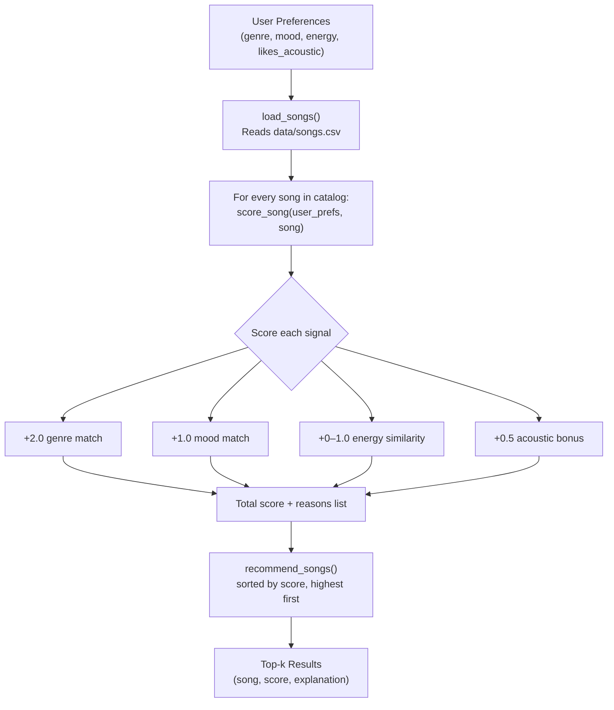

# 🎵 Music Recommender Simulation

## Project Summary

This project builds a **content-based music recommender** that suggests songs from a 20-track catalog based on a user's stated taste preferences. Rather than watching what other listeners play (collaborative filtering), it reads each song's audio attributes directly—genre, mood, energy, acousticness—and scores how well they match the user's profile. The simulation is intentionally small and transparent so every recommendation can be traced back to a clear mathematical reason.

---

## How The System Works

### Real-World Recommenders

Streaming platforms like Spotify and YouTube combine two main strategies:

- **Collaborative filtering** groups users by shared listening behavior. If you and many others both loved Artist A and then discovered Artist B, the system infers that someone new to Artist A should also hear Artist B—even if the two songs sound completely different.
- **Content-based filtering** looks at the song itself: tempo, energy, danceability, mood. It matches those attributes to a user's stated or inferred preferences without needing data from other users.

Real systems blend both: collaborative filtering provides serendipity and social signal, while content-based filtering handles cold-start situations (new users or new songs with no listening history yet). Key data types involved include explicit signals (likes, skips, playlist adds, replays) and implicit signals (completion rate, time of day, shuffle vs. repeat).

### This Simulation

This simulation uses **content-based filtering only**, scoring every song in the catalog against a hand-crafted user profile.

**Data flow:**



### Algorithm Recipe (Scoring Rule)

For each song, `score_song()` adds up:

| Signal | Points | Why |
| --- | --- | --- |
| Genre matches user's favorite | +2.0 | Genre is the strongest structural filter |
| Mood matches user's target mood | +1.0 | Mood captures emotional intent |
| Energy similarity | up to +1.0 | `1.0 - abs(song_energy - user_energy)` rewards closeness, not just high/low |
| Acoustic bonus | +0.5 | Only fires when `likes_acoustic=True` AND `acousticness > 0.7` |

**Ranking Rule:** Once every song has a score, `sorted(..., reverse=True)` produces the final ranking. The top-k results are returned with both a numeric score and a plain-English explanation string.

### Song and UserProfile Features

Each **Song** stores: `id`, `title`, `artist`, `genre`, `mood`, `energy` (0–1), `tempo_bpm`, `valence` (0–1), `danceability` (0–1), `acousticness` (0–1).

Each **UserProfile** stores: `favorite_genre`, `favorite_mood`, `target_energy` (0–1), `likes_acoustic` (bool).

---

## Getting Started

### Setup

```bash
python -m venv .venv
source .venv/bin/activate      # Mac or Linux
.venv\Scripts\activate         # Windows

pip install -r requirements.txt
```

### Run the Recommender

```bash
python -m src.main
```

### Running Tests

```bash
pytest
```

---

## Experiments You Tried

### Profile 1 — High-Energy Pop

```text
============================================================
  Profile: High-Energy Pop
============================================================
  #1  Sunrise City - Neon Echo
       Score : 3.97
       Why   : genre match (+2.0); mood match (+1.0); energy similarity (+0.97)

  #2  Gym Hero - Max Pulse
       Score : 2.92
       Why   : genre match (+2.0); energy similarity (+0.92)

  #3  Neon Waltz - Prism Keys
       Score : 1.94
       Why   : mood match (+1.0); energy similarity (+0.94)

  #4  Rooftop Lights - Indigo Parade
       Score : 1.91
       Why   : mood match (+1.0); energy similarity (+0.91)

  #5  Sunrise Sermon - Grace Notes
       Score : 1.82
       Why   : mood match (+1.0); energy similarity (+0.82)
```

"Sunrise City" scored highest (3.97) — a full genre + mood + energy match. "Gym Hero" came second despite `mood: intense` because it still matched genre and energy closely. The results felt accurate: all five songs have a bright, upbeat character that fits a pop/happy listener.

### Profile 2 — Chill Lofi

```text
============================================================
  Profile: Chill Lofi
============================================================
  #1  Library Rain - Paper Lanterns
       Score : 4.47
       Why   : genre match (+2.0); mood match (+1.0); energy similarity (+0.97); acoustic vibe match (+0.5)

  #2  Midnight Coding - LoRoom
       Score : 4.46
       Why   : genre match (+2.0); mood match (+1.0); energy similarity (+0.96); acoustic vibe match (+0.5)

  #3  Focus Flow - LoRoom
       Score : 3.48
       Why   : genre match (+2.0); energy similarity (+0.98); acoustic vibe match (+0.5)

  #4  Quiet Autumn - The Hollow Pine
       Score : 2.42
       Why   : mood match (+1.0); energy similarity (+0.92); acoustic vibe match (+0.5)

  #5  Spacewalk Thoughts - Orbit Bloom
       Score : 2.40
       Why   : mood match (+1.0); energy similarity (+0.90); acoustic vibe match (+0.5)
```

"Library Rain" and "Midnight Coding" nearly tied (~4.47), separated only by 0.01 in energy similarity. "Focus Flow" ranked third — it missed mood (focused ≠ chill) but still earned genre + energy + acoustic. Positions 4-5 were acoustic, low-energy folk and ambient, which would genuinely appeal to a lofi listener.

### Profile 3 — Deep Intense Rock

```text
============================================================
  Profile: Deep Intense Rock
============================================================
  #1  Storm Runner - Voltline
       Score : 3.99
       Why   : genre match (+2.0); mood match (+1.0); energy similarity (+0.99)

  #2  Gym Hero - Max Pulse
       Score : 1.99
       Why   : mood match (+1.0); energy similarity (+0.99)

  #3  Shatter The Sky - Iron Veil
       Score : 1.95
       Why   : mood match (+1.0); energy similarity (+0.95)

  #4  Pulse District - DRVT
       Score : 0.97
       Why   : energy similarity (+0.97)

  #5  Back To The Block - Cipher K
       Score : 0.91
       Why   : energy similarity (+0.91)
```

"Storm Runner" won decisively at 3.99. Slots 2-5 went to high-energy songs from pop, metal, EDM, and hip-hop — none matched genre. This exposed the catalog's rock scarcity (only 1 rock song). When a genre is underrepresented, energy proximity becomes the only tiebreaker, producing a tail that a true rock fan would likely reject.

### Profile 4 — Adversarial (High-Energy + Sad)

This is an **adversarial edge-case profile**: `genre: r&b, mood: sad, energy: 0.90`. The conflict is intentional — no song in the catalog is simultaneously high-energy and sad. The system must compromise.

```text
============================================================
  Profile: Adversarial (High-Energy + Sad)
============================================================
  #1  Velvet Underground - Sable Moon
       Score : 2.68
       Why   : genre match (+2.0); energy similarity (+0.68)

  #2  Storm Runner - Voltline
       Score : 0.99
       Why   : energy similarity (+0.99)

  #3  Gym Hero - Max Pulse
       Score : 0.97
       Why   : energy similarity (+0.97)

  #4  Pulse District - DRVT
       Score : 0.95
       Why   : energy similarity (+0.95)

  #5  Shatter The Sky - Iron Veil
       Score : 0.93
       Why   : energy similarity (+0.93)
```

**What this reveals about the system:** "Velvet Underground" (r&b, moody) won because the genre match (+2.0) overwhelmed everything else — even though its energy (0.58) is far from the user's 0.90 target. The mood "sad" never fired at all because no catalog song carries that exact label. This is the adversarial failure mode: conflicting preferences cause the genre signal to dominate by default, and the "sad" mood preference is silently ignored. A real system would surface this to the user ("We couldn't find sad songs with high energy — here's the closest we found").

### Weight Shift Experiment

Doubling energy weight to 2.0 and halving genre to 1.0 caused "Gym Hero" to overtake "Sunrise City" for the pop profile because Gym Hero's energy (0.93) is closer to the user's target (0.85) than Sunrise City's (0.82). This revealed that the default genre-heavy weighting is intentional: it keeps recommendations thematically coherent.

### Feature Removal Experiment

Commenting out the mood check eliminated the score gap between "Sunrise City" and "Gym Hero" for the pop profile — they both matched on genre and energy. This shows that mood is the key differentiator between an "upbeat pop banger" and a "workout pop anthem."

---

## Limitations and Risks

- Works on a 20-song catalog only—real systems need millions of tracks to escape obvious filter bubbles.
- Does not read lyrics, language, or cultural context.
- Genre labels are rigid: "rock" and "metal" are unrelated strings even though they share sonic characteristics.
- Energy similarity alone can surface acoustically distant songs if genre/mood don't match; a jazz song at energy 0.38 will rank alongside a lofi song just because the numbers match.
- No listening history means the system cannot adapt to a user's changing taste over time.

---

## Reflection

See [model_card.md](model_card.md) for the full model card and personal reflection.

Building this project made it clear how much work a simple string comparison (genre matching) actually does. Two songs can have identical energy and mood values but feel completely different because they belong to different genres—and yet without that genre label, the algorithm would never know. Real-world systems solve this by learning dense embeddings from audio waveforms, so "rock" and "metal" end up geometrically close in a vector space even if the labels differ. The most surprising moment was discovering that the "Chill Lofi" profile produced the most decisive recommendations: because multiple songs hit the same high ceiling of genre + mood + acoustic match, the energy similarity score became a fine-grained tiebreaker—exactly the kind of nuance a real recommender needs.
